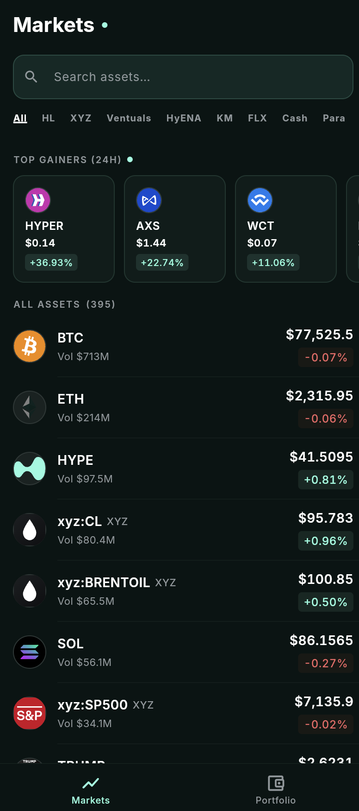
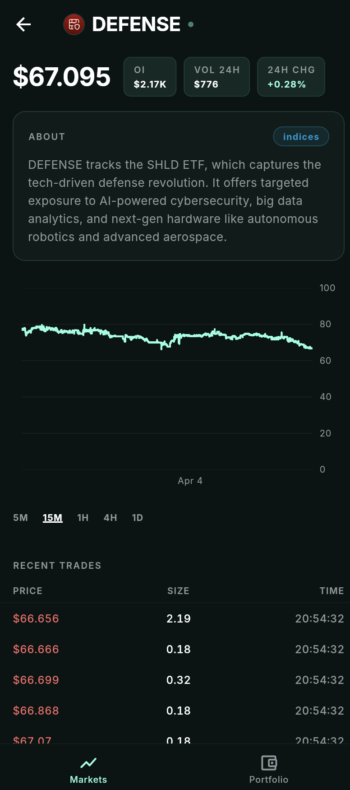
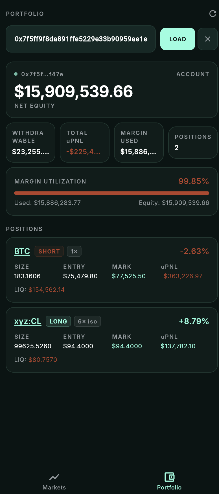

# Hyperliquid Portfolio Tracker

A Flutter application for monitoring real-time Hyperliquid market data and portfolio positions.

---

## About

Hyperliquid Portfolio Tracker is a mobile-first Flutter application that gives traders a real-time window into the Hyperliquid ecosystem — no wallet connection or signing required.

**Markets tab**
- Streams live mid prices for every perpetual asset across all Hyperliquid DEXes (HL, XYZ, Ventuals, HyENA, and more) via WebSocket
- Full asset list with 24h price change and volume, sortable by name, price, change, or volume
- DEX filter strip to isolate a specific venue or view all at once
- Top gainers strip highlighting the 5 biggest movers
- Search to quickly find any asset by name
- Asset detail view with a price chart (selectable timeframes: 15m → 1W), a live trade feed, and a description card

**Portfolio tab**
- Enter any public Hyperliquid wallet address (read-only, no signing)
- Displays net equity, withdrawable balance, total margin used, and a visual margin utilization bar
- Full list of open perpetual positions with size, entry price, mark price, and unrealized PnL
- Pull-to-refresh to update account data on demand
- Tapping a position navigates directly to that asset's detail view

---

## Views

| Market List | Asset Detail | Portfolio |
|:-----------:|:------------:|:---------:|
|  |  |  |

---

## Architecture

### Directory Structure

The project follows a **feature-first, layered** organization:

```
lib/
├── app/              # Entry point, routing (GoRouter), theme
├── core/             # Shared infrastructure (networking, error handling, utilities)
├── shared_ui/        # Cross-feature widgets and providers (live price stream)
└── features/
    ├── market/       # Market list, asset detail, candle chart, trade feed
    └── portfolio/    # Address input, account summary, open positions
```

Each feature is internally split into three layers:

```
features/<feature>/
├── data/
│   ├── dto/          # Raw JSON shapes (fromJson only)
│   ├── services/     # REST and WebSocket calls
│   ├── mappers/      # DTO → Domain entity conversion
│   └── repositories/ # Implements the domain interface
├── domain/
│   ├── entities/     # Immutable business objects (Equatable)
│   └── repositories/ # Abstract interfaces (no concrete dependencies)
└── presentation/
    ├── providers/    # Riverpod provider definitions
    ├── view_models/  # StateNotifier + ViewState (pure business logic, no Flutter)
    ├── views/        # Screen-level ConsumerWidgets
    └── widgets/      # Reusable UI components
```

### State Management — Riverpod

State is managed entirely with **Riverpod**. The pattern used throughout:

- **`StateNotifierProvider`** — each screen has a `ViewModel` (extends `StateNotifier<ViewState>`) that holds all business logic. Views `watch` the provider; they never call services directly.
- **`StateNotifier<ViewState>`** — `ViewState` is an immutable `Equatable` value class with a typed `copyWith`. This makes state transitions explicit and diffable.
- **`ref.watch(...select(...))`** — used in `MarketView` to prevent full rebuilds when only a single field (e.g. `isLoading`) changes.
- **`liveMidsProvider`** — a dedicated `StateNotifierProvider` that owns the live WebSocket price map. It is intentionally separate from `MarketViewState` so that a price tick never triggers a resort or rebuild of the full list. Individual `AssetRow` widgets subscribe to `liveMidsProvider.select((m) => m[coin])` so only the affected row repaints.

### Networking

**REST** — `Dio` with a typed `HyperliquidInfoClient` wrapper. All REST calls go to the `/info` endpoint as POST with a `type` discriminator. A `DexFanOut` utility fires all known DEX requests in parallel (`Future.wait`) and merges results, surfacing only the default-DEX error if everything fails.

**WebSocket** — `WsManager` wraps `web_socket_channel` and handles subscribe/unsubscribe by maintaining an active subscriptions list. On disconnect it applies exponential-backoff reconnect and automatically resubscribes. `HyperliquidWsService` sits on top and exposes typed `Stream`s (mids, trades). The `liveMidsProvider` batches incoming mids ticks on a timer before pushing state, preventing the UI thread from saturating on high-frequency updates.

### Error Handling

All data-layer functions return a **sealed `Result<T>`** type (`Ok<T>` / `Err<T>`) rather than throwing exceptions. `Result.fold(ok:, err:)` forces callers to handle both branches. `AppFailure` is the typed error carrier with concrete subtypes (`UpstreamFailure`, `ValidationFailure`, etc.).

### Routing

**GoRouter** with a `StatefulShellRoute.indexedStack` for the two-tab bottom nav (Markets / Portfolio). The market branch has a nested route `/market/:coin` for the asset detail view. Navigation from the Portfolio positions list to an asset detail uses `context.go('/market/$coin')`, keeping the router as the single source of truth for navigation state.

---

## Known Limitations

- **CORS / SVG coin icons** — The web build uses a `dart:html` `HtmlElementView` + `platformViewRegistry` workaround to render coin SVGs that would otherwise be blocked by the browser's CORS policy. This is web-only; on native mobile, icons silently fall back to a text abbreviation. The clean solution would be a lightweight proxy server or a CORS-enabled CDN hosting the SVG assets.

- **Portfolio refresh is manual only** — Portfolio data (positions, equity, PnL) is fetched once on address load and only updates on pull-to-refresh. The Hyperliquid WebSocket supports a `clearinghouseState` subscription that would push live updates, but it was not wired into the `PortfolioViewModel` within the scope of this project.

---

## If I Had More Time

- **Live PnL via WebSocket** — The live mids stream is already running globally. Hooking the portfolio's open positions into that stream would let unrealized PnL update in real time without any additional REST calls.

- **Candlestick chart + crosshair** — The `Candle` domain entity already carries `open`, `high`, `low`, and `close` fields. Swapping the current `LineSeries` for Syncfusion's `CandleSeries`, adding a crosshair tooltip showing full OHLCV, and a range selector strip would make the chart significantly more useful.

- **Trades / filled orders tab** — The Hyperliquid API exposes a `userFills` endpoint. A history tab on the Portfolio page showing past fills with PnL per trade would be a natural complement to the open positions view.

- **Order book / open orders** — Displaying the current order book depth and a user's resting orders would round out the Portfolio page into a complete account view.

- **Market-page trading UI** — Placing orders requires wallet signing and is explicitly out of scope per the spec, but it is the logical next step once the read-only layer is solid.

- **Push notifications** — Alerting a user when a position's unrealized PnL crosses a configurable threshold. This would require a background service and platform notification permissions.

- **Light theme** — The app is dark-mode only. Because all colors are centralized in `AppColors`, adding a light theme would be a straightforward extension of the existing theming layer.

- **One-click position mirroring** — A "Follow Trade" button on each position card that pre-fills an order ticket with the same coin, direction, and size as the position currently displayed. Requires wallet signing but the UI surface is already there.

- **Watchlists for accounts and assets** — Ability to star/bookmark wallet addresses and individual assets. Starred items would appear in a dedicated Watchlist tab and serve as the basis for targeted notifications (e.g. alert when a watched wallet opens or closes a position, or when a watched asset moves ±X%).

- **Copy trading with configurable rules** — An extension of the watchlist idea: opt into automatically mirroring trades from a watched wallet if they meet user-defined criteria (minimum notional size, specific assets, maximum leverage, etc.). Trades passing the filter would be submitted immediately via the Hyperliquid order API. Requires wallet signing and a robust rule engine, but the data pipeline (live positions + fills) is already in place.
